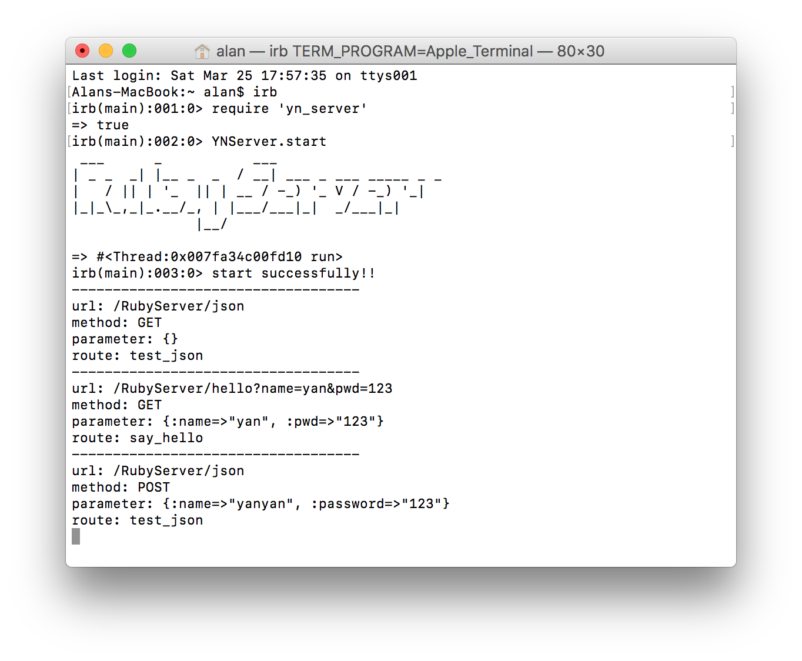

## Ruby使用Socket处理Http请求

### How to use

terminal input:

```ruby
# you can install gem or load the file 
$ gem install yn_server
$ irb
$ require 'yn_server'
# use YNServer.start(port) to start the server, port defaults to 2000
$ YNServer.start
```



**详细内容请查看博客地址：**

[http://mia2002.cn/blog/ruby-socket](http://mia2002.cn/blog/ruby-socket)


>e-mail：yan@yerl.cn

>blog：mia2002.cn
